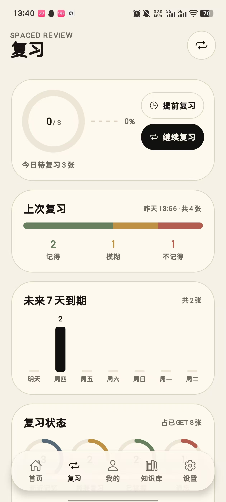
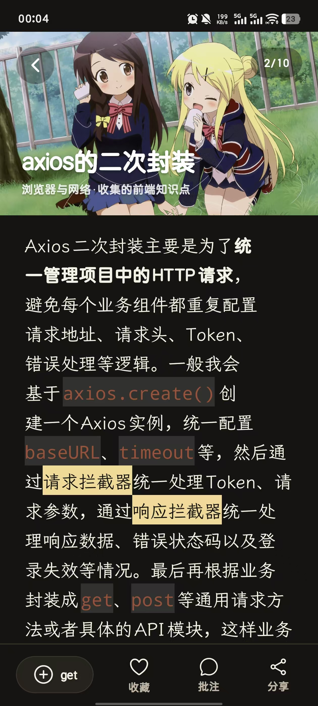
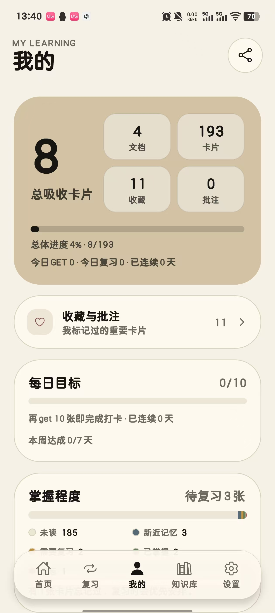
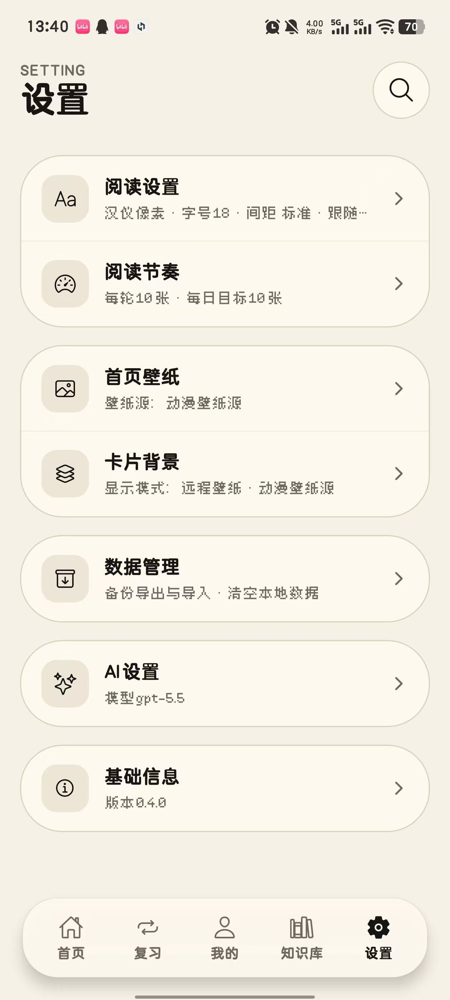
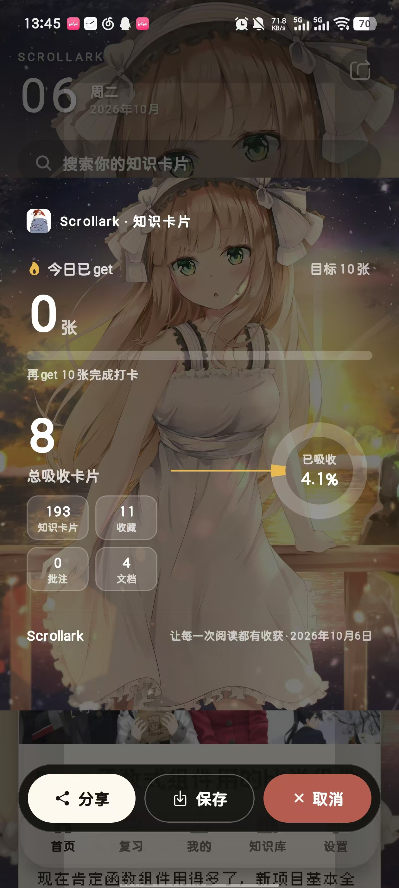
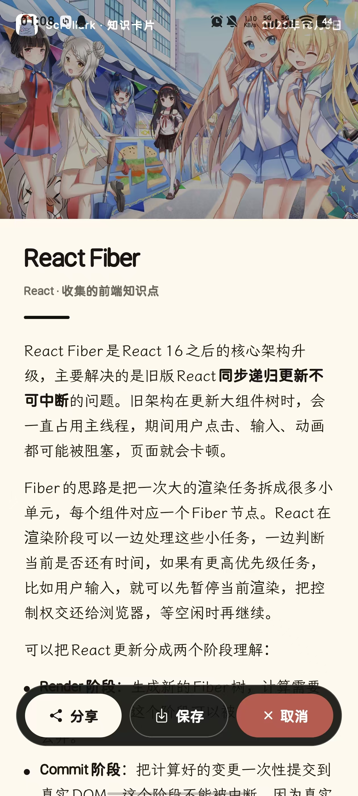
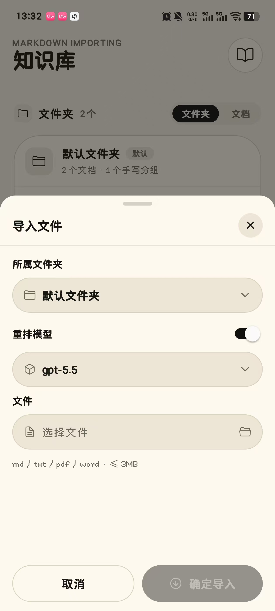
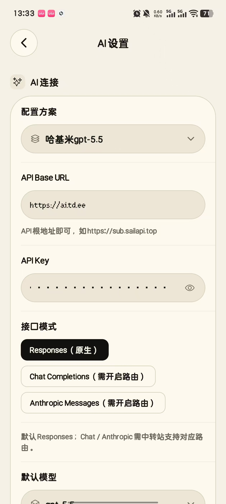
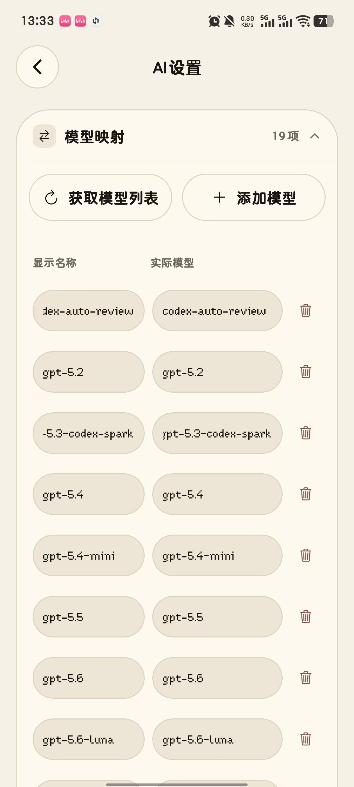
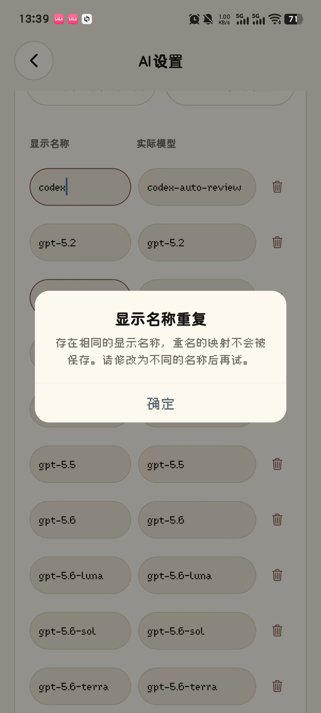

# 🌟Scrollark

Scrollark 是一款面向 Markdown 知识文档的移动端卡片阅读应用。应用会将本地文档（md / txt / pdf / word）导入到本机数据库，并按照约定的标题层级拆分为可刷读、可收藏、可批注、可统计的知识卡片；不符合标题层级的文档还可以选择交给 AI 重排成标准结构后再切卡，适合把长篇笔记、课程资料、读书摘录等内容转化为轻量复习流。

安装包请见 [RELEASE.md](./RELEASE.md)。

> 当前项目基于 Expo / React Native / TypeScript 开发，主要面向 Android 竖屏阅读场景，坚持本地优先：无账号、无云端，全部数据保存在本机；AI 重排采用「用户自带 API Key」模式，请求由设备直接发往你配置的服务商。

## 目录

- [功能概览](#功能概览)
- [界面预览](#界面预览)
- [技术栈](#技术栈)
- [快速开始](#快速开始)
- [项目结构](#项目结构)
- [Markdown 文档切分策略](#markdown-文档切分策略)
- [数据存储与运行机制](#数据存储与运行机制)
- [配置说明](#配置说明)
- [常用脚本](#常用脚本)
- [开发规范建议](#开发规范建议)
- [版本信息](#版本信息)

## 功能概览

### 首页与导航

- **底部悬浮导航**：iOS 风格的圆角悬浮 Tab 栏（首页 / 复习 / 我的 / 知识库 / 设置），负责「去哪里」；自动避让底部手势区。
- **返回即上一页**：硬件返回键与各页返回按钮都沿导航历史回退；会话总结等流程中间态自动跳过，只有显式「返回首页」才重置历史。
- **今日学习面板**：目标进度大数字 + 动态按钮（未达标「去 GET 新卡」/ 达标「去复习」）+ 已 GET / 已掌握 / 待复习 / 连续天数。
- **今日推荐**：从全部卡片中随机抽取 3 张纵向展示；点击进入**随机 GET**——从未读卡池随机抽取开始学习，不是固定学点击的那张。
- **复习提醒**：有待复习卡片时显示数量与进入遗忘阶段的数量，点击进入复习 Tab。
- **搜索前置**：首页顶部搜索框直达全局搜索。

### 导入与知识库

- **文件导入**：从手机本地选择 md / txt（≤3MB）导入，导入前通过配置弹窗完成「所属文件夹 / 重排模型开关 / 选择文件」三项配置；原文会自动复制到应用文档目录留档。
- **AI 重排（可选）**：开启「重排模型」开关后，任意支持的文件（md / txt / pdf / word）都会先交给 AI 解析整理成符合标题层级的标准 Markdown，再走统一切卡流程；重排模型可在导入时从模型映射中临时切换。AI 采用「用户自带 API Key」模式，支持 OpenAI Compatible 的 **Responses（原生）/ Chat Completions / Anthropic Messages** 三种接口模式，未配置 AI 时与原有导入行为完全一致。
- **模型映射**：「菜单显示名 → 实际请求模型」对照表，可从 `/models` 拉取模型列表（本地缓存，端点或 Key 变更后自动失效）或手动添加；显示名称重名时阻断保存并提示。
- **配置方案**：整组 Base URL / API Key / 模型 / 接口模式可命名保存为方案，多家中转站一键切换；保存配置后有未保存修改退出会拦截提示。
- **导入容错**：导入过程展示进度条弹窗（可随时取消，取消即丢弃 AI 返回内容）；同名文档自动重命名（xxx(1)）；AI 失败时弹窗展示具体报错与 AI 原始返回内容（可滚动复制）。
- **标题层级切分**：以三级标题作为最小卡片单位，一级、二级标题分别作为文档与分组上下文；代码块内的 `#` 不会误触发切分；无三级标题的文档整篇作为一张卡片。
- **文件夹与手写分组**：文件夹是文档与手写分组的容器，手写分组作为文件夹里的一份「文件」，按「文件夹 → 分组 → 卡片」组织；支持新建（下拉选所属文件夹 + 填写名称）、改名、移动与删除；列表可在「文件夹 / 文档」两种视图间切换（配置持久化）。
- **卡片列表页**：点击文档或手写分组直接进入其卡片列表页（替代 Markdown 内容预览），每张卡片右上角提供红色删除角标，删除即时同步列表与数据库。
- **卡片操作区**：卡片详情统一为 [编辑] [删除] [分享]，删除为红色危险样式、位于分享左侧；手写卡片支持编辑标题、分组与正文，导入文档的卡片同样可逐张删除。
- **文档编辑两级流程**：先编辑文档信息（标题 / 所属文件夹），再按需进入二级全屏内容编辑页；只改信息不影响已生成卡片，内容修改后按新内容重新切卡（二次确认）。
- **删除保护与兜底**：删除文件夹会连同其中文档、分组、卡片与本机文件一并删除，内置的「手动创建」分组文档受保护、自动移回默认文件夹；未选择文件夹 / 分组时自动兜底到默认文件夹与「手写」分组，不产生孤立数据。
- **悬浮操作钮**：知识库右下角的「＋」悬浮按钮收纳导入文件 / 手写卡片 / 开始 GET 三个入口；操作结果以顶部悬浮 toast 提示。

### GET：获取新知识

- **刷卡式阅读**：竖向整页翻卡浏览未读新卡，每轮从全部未读卡中**随机抽取**，每轮卡片数可设置（10 / 20 / 30 张）。
- **Get 标记**：点击 get 将卡片标记为「已学」，系统自动为其安排明天的第一次复习；再次点击可取消。
- **双击收藏**：阅读中双击卡片即可收藏，并在点击位置弹出爱心动效。
- **批注**：每张卡片可写一条批注，浮层编辑器支持键盘避让，未保存离开会二次确认。
- **轮次总结**：每轮结束展示浏览、get、收藏、批注数量。

### 复习：主动回忆 + 间隔重复

- **独立复习流程**：从复习页或首页一键进入，先看标题主动回忆，再揭示答案自我检查，最后给出三档反馈：不记得 / 模糊记得 / 记得。
- **遗忘曲线调度**：复习间隔随反馈进退——「记得」逐档拉长（1 / 3 / 7 / 16 / 35 天），「模糊记得」缩短间隔，「不记得」第二天优先再来；GET 后的卡片第二天进入第一次复习。
- **自动安排**：系统自动决定今天最值得复习的卡片（遗忘过 / 逾期最久的优先），用户无需自己管理复习计划。
- **提前复习**：新近记忆与巩固中的卡片不用等到期，可随时主动过一遍；只有明确评级才会更新复习计划。
- **今日复习收尾**：到期卡片复习完毕后明确展示「今日复习完成」，并提供「去 GET 新卡」继续学习。
- **复习进度**：复习中显示「n / 总数」进度条；复习页用环形仪表展示今日复习进度，以及四档复习状态（新近记忆 / 需要复习 / 已掌握 / 遗忘，按最近一次反馈划分）。

### 整理与检索

- **全局搜索**：首页顶部搜索框直达，同时检索卡片标题、正文、批注与来源文档，结果附带复习状态徽标。
- **收藏与批注页**：集中查看所有收藏卡片与批注，可再次编辑。
- **卡片详情**：全屏查看卡片全文、批注与头图，底部展示当前复习状态与下次复习时间。

### 我的：学习档案

- **今日动态**：学习成果卡展示总吸收进度、今日 GET、今日复习与连续学习天数。
- **收藏与批注入口**：位于页面顶部，一键进入我标记过的卡片。
- **掌握程度分布**：未读 / 新近记忆 / 需要复习 / 已掌握 / 遗忘五段式一览，按最近一次反馈划分。
- **阅读统计**：总卡片数、已 get 数、收藏数、批注数、今日 get 数一览。
- **每日目标**：可设定每日 get 目标（关闭 / 5 / 10 / 20 / 30 张），展示连续学习天数。
- **年度热力图**：GitHub 风格的近一年打卡热力图，按天聚合 get 与复习行为。
- **7 天趋势**：近七天阅读曲线。

### 分享与壁纸

- **单卡长图分享**：将卡片（可含批注）渲染为纸质风格长图海报，分享给朋友或保存到相册。
- **数据海报分享**：以当前壁纸为背景，生成环形图数据海报，展示吸收占比、今日进度与核心统计。
- **每日壁纸**：首页壁纸每日自动更换，多源回退下载，失败沿用昨日缓存；长按壁纸即可保存，支持系统相册或自选目录。
- **卡片头图**：本地图库 / 远程壁纸 / 不显示三种模式；远程模式支持多个壁纸源回退与图池复用（每卡一张或 4 / 8 / 16 / 20 张轮换），下载失败自动落到本地兜底图。

### 个性化与数据安全

- **字体**：内置霞鹜文楷、思源宋体、汉仪楷体、汉仪像素、方软糖体五款字体，标题、加粗、代码块等特殊格式同样跟随所选字体。
- **字号**：四档正文可调。
- **主题**：亮色 / 暗色 / 跟随系统。
- **AI 设置**：自带 API Key 的 AI 重排配置——Base URL / API Key / 默认模型 / 接口模式 / 模型映射，均保存在本机；支持配置方案一键切换、模型列表本地缓存、退出未保存拦截。
- **设置分级**：设置页按系统设置风格分块只显示入口（字体设置与阅读节奏 / 首页壁纸与卡片背景 / 数据管理 / AI 设置 / 基础信息），点入二级页修改具体配置；全局弹窗使用统一风格的自定义弹窗，明暗主题自适应。
- **本地优先**：文档、卡片、批注、统计与设置全部保存在本机 SQLite，无账号体系。
- **复习状态**：卡片详情与搜索结果都会展示当前复习状态（未 GET / 新近记忆 / 待复习 / 巩固中 / 已掌握 / 遗忘，按最近一次反馈划分）。
- **数据备份**：一键导出全量数据（文件夹、分组、文档、卡片、复习计划、收藏、批注、行为事件与设置）为 JSON 文件，也可从备份文件整体恢复；自定义卡片配图以 base64 内嵌进备份，换机后配图不丢；导入先解析后校验并跳过悬空引用，老备份兼容。
- **一键清空**：数据管理页内可确认后清空全部本地数据（含卡片配图、头图与文档本机副本）。
- **基础信息**：查看应用版本号，点击直达 GitHub 项目主页。

## 界面预览

### 基础页面

| 首页 | 复习页 | 复习进行中 | 刷知识页 |
| --- | --- | --- | --- |
|  |  |  |  |

| 我的 | 知识库页 | 收藏与批注页 | 设置页 |
| --- | --- | --- | --- |
|  |  |  |  |

### 分享页面卡片

| 首页壁纸分享                                                 | 卡片内容分享                                                 |
| ------------------------------------------------------------ | ------------------------------------------------------------ |
|  |  |

### AI 导入与设置

<!-- 截图待补充：将对应名称的图片放入 docs/screenshots/ 即可显示 -->

| 导入文件弹窗 | AI 设置 | 模型映射 |
| --- | --- | --- |
|  |  |  |

| 导入进度条 | 配置方案 | 同名重命名提示 |
| --- | --- | --- |
|  |  |  |


## 技术栈

| 类型 | 选型 |
| --- | --- |
| 应用框架 | Expo `~55.0.31` |
| UI 运行时 | React `19.2.0`、React Native `0.83.10` |
| 语言 | TypeScript `~5.9.2` |
| 本地数据库 | `expo-sqlite` |
| 文件选择 | `expo-document-picker` |
| 文件系统 | `expo-file-system` |
| 字体加载 | `expo-font` |
| 图标 | `@expo/vector-icons` |
| 毛玻璃效果 | `expo-blur` |
| 海报截图 | `react-native-view-shot` |
| 数据图表 | `react-native-svg` |
| 系统分享 | `expo-sharing` |
| 相册保存 | `expo-media-library` |

## 快速开始

### 1. 安装依赖

```bash
npm install
```

### 2. 启动开发服务

```bash
npm run start
```

随后可以根据 Expo 提示选择真机、模拟器或开发构建运行。

### 3. Android 本地运行

```bash
npm run android
```

### 4. Web 预览（用于基础调试）

```bash
npm run web
```

> 说明：项目包含文档选择、本地文件、SQLite、相册保存等移动端能力，Web 预览只适合进行部分界面和逻辑调试，最终行为应以 Android 设备为准。

## 项目结构

```text
Scrollark/
├── android/                    # Expo 生成的 Android 原生工程
├── fonts/                      # 应用内置字体资源
│   ├── LXGWWENKAI-REGULAR.ttf             # 霞鹜文楷
│   ├── SourceHanSerifCN-Regular.otf       # 思源宋体
│   ├── HanYiKaiTiJian-1.ttf               # 汉仪楷体
│   ├── HYPixel9pxJ-2.ttf                  # 汉仪像素
│   └── AaKeAiBeiTianTianQuanZhuLiao-2.ttf # 方软糖体
├── docs/
│   └── screenshots/            # README 展示截图（仅文档使用，不参与应用构建）
├── img/                        # 应用图片资源（会被打进 APK，仅存放运行时用图）
│   ├── softicon.png            # 应用图标与 Android adaptive icon 前景图
│   ├── cardimg/                # 卡片头图本地资源
│   └── heroimg/                # 首页背景本地兜底资源
├── scripts/
│   └── subset-fonts.py         # 字体子集化脚本
├── src/
│   ├── App.tsx                 # 应用入口、导航历史栈、全局数据刷新与底部导航
│   ├── components/             # 可复用组件
│   │   ├── AppButton.tsx           # 通用按钮
│   │   ├── TabBar.tsx              # 底部悬浮导航栏（iOS 风格）
│   │   ├── RingProgress.tsx        # 环形进度（复习仪表盘）
│   │   ├── CardDetailModal.tsx     # 卡片全屏详情弹窗
│   │   ├── CardHeaderImage.tsx     # 卡片头图解析（图池 / 缓存 / 多源回退）
│   │   ├── KnowledgeCard.tsx       # 知识卡片主体（完整 / 紧凑双形态、双击识别、回忆遮罩）
│   │   ├── MarkdownRenderer.tsx    # Markdown 渲染组件
│   │   ├── AnnotationEditor.tsx    # 批注编辑浮层
│   │   ├── AppSelectSheet.tsx      # 底部下拉选择弹层（文件夹 / 模型等）
│   │   ├── ImportConfigModal.tsx   # 导入配置弹窗（文件夹 / 重排模型开关 / 文件与进度）
│   │   ├── ShareCardOverlay.tsx    # 单卡分享浮层
│   │   ├── SharePoster.tsx         # 单卡长图海报
│   │   ├── PosterShareKit.tsx      # 海报截图与分享 / 保存工具
│   │   └── HomeShareOverlay.tsx    # 首页数据海报
│   ├── config/
│   │   └── imageUrls.ts            # 远程壁纸 / 卡片图地址配置
│   ├── data/
│   │   └── repository.ts           # SQLite 建表、迁移、导入、GET / 复习调度、备份与写入逻辑
│   ├── domain/
│   │   └── types.ts                # 路由、文档、卡片、设置、统计等类型定义
│   ├── screens/                    # 页面级组件
│   │   ├── HomeScreen.tsx          # 首页（今日学习、推荐、复习提醒与壁纸）
│   │   ├── ReviewHubScreen.tsx     # 复习页（今日进度仪表、状态环与操作区）
│   │   ├── ReviewScreen.tsx        # 复习流程（回忆 → 揭示 → 三档反馈）
│   │   ├── KnowledgeScreen.tsx     # 知识库（导入、更新、删除、预览）
│   │   ├── SessionScreen.tsx       # GET 刷卡会话
│   │   ├── SessionEndScreen.tsx    # 单轮 GET 总结
│   │   ├── FavoritesScreen.tsx     # 收藏与批注
│   │   ├── StatisticsScreen.tsx    # 我的（学习档案与统计）
│   │   ├── SearchScreen.tsx        # 全局搜索
│   │   └── SettingsScreen.tsx      # 设置页
│   ├── theme/                      # 主题、字体、设计 token 与图片资源映射
│   └── utils/                      # AI 文档转换、Markdown、字体排版、日期、首页背景、复习状态、图片下载等工具函数
├── app.json                    # Expo 应用配置
├── eas.json                    # EAS 构建配置
├── package.json                # 依赖与脚本
├── tsconfig.json               # TypeScript 配置
└── README.md                   # 项目说明文档
```

### 关键目录职责

- `src/data/repository.ts` 是数据访问层，集中处理数据库初始化、表结构迁移、Markdown 导入、卡片状态更新、统计查询与数据清空。
- `src/utils/markdown.ts` 是 Markdown 解析核心，负责将原始文档切分为卡片，并将卡片正文进一步解析为可渲染块。
- `src/components/MarkdownRenderer.tsx` 是轻量 Markdown 渲染器，支持标题、段落、引用、列表、代码块、表格以及部分行内样式。
- `src/components/CardHeaderImage.tsx` 负责卡片头图的解析策略：内存缓存、数据库持久化、图池复用、多源下载回退与本地兜底。
- `src/utils/homeBackground.ts` 负责首页每日壁纸的下载、缓存与保存。
- `src/utils/review.ts` 定义复习状态的统一口径（按最近一次反馈划分），供搜索、卡片详情与「我的」页复用。
- `src/theme/` 统一维护字体、图片、主题 token 和明暗色模式，避免页面内硬编码视觉规则。
- `docs/screenshots/` 仅用于项目文档展示，不参与应用构建；`img/` 目录只存放运行时用图（会被打进 APK）。

## Markdown 文档切分策略

Scrollark 的核心导入规则位于 `src/utils/markdown.ts` 的 `parseMarkdownToCards` 函数中。当前采用「按三级标题生成卡片」的策略。如果导入的文档不符合该层级结构，可在导入时开启「重排模型」，由 AI 先整理为标准 Markdown 再走同一套解析（见 `src/utils/ai.ts`）。

### 标题层级语义

| Markdown 层级 | 在 Scrollark 中的作用 | 是否直接生成卡片 |
| --- | --- | --- |
| `# 一级标题` | 文档主标题 / 大主题，对应卡片的 `h1` 上下文 | 否 |
| `## 二级标题` | 分组标题，对应卡片的 `h2` 上下文 | 否 |
| `### 三级标题` | 卡片标题，对应卡片的 `h3` 和 `title` | 是 |
| `####` 至 `######` | 作为卡片正文内容保留 | 否 |

### 切分流程

1. **统一换行符**：导入时会将 `CRLF`、`CR` 统一为 `LF`，降低不同系统编辑文档造成的解析差异。
2. **读取一级标题**：遇到 `#` 标题时，更新当前文档主题 `h1`，并将二级分组重置为 `未分组`。
3. **读取二级标题**：遇到 `##` 标题时，更新当前分组 `h2`。
4. **生成卡片起点**：遇到 `###` 标题时，结束上一张卡片，并以该三级标题开启一张新卡片。
5. **写入卡片正文**：三级标题之后、下一个同级或更高级标题之前的内容，会作为当前卡片正文。
6. **保护代码块**：在三个反引号包裹的代码块内，形如 `#`、`##`、`###` 的内容不会触发切分。
7. **兜底策略**：如果整篇文档没有任何三级标题，则整篇文档会作为一张卡片导入，分组记为 `全文`。

### 边界规则

- 当文档存在至少一个三级标题时，只有归属到三级标题下的内容会进入卡片；位于第一个 `###` 之前的普通正文不会生成独立卡片，建议不要在该区域放置必须复习的正文。
- 当文档存在多个一级标题时，后续卡片会使用解析时最近的一级标题作为 `h1` 上下文；文档记录的展示标题以解析结束时的当前一级标题为准。因此更推荐一份文档只使用一个一级标题。
- 当遇到新的 `#`、`##` 或 `###` 标题时，上一张正在收集的卡片会立即收束入库。
- 四级至六级标题不会触发切分，会原样进入当前卡片正文。
- 代码块围栏未闭合时，后续内容会持续按代码块内容处理，可能影响标题识别；导入前应确保 Markdown 语法完整。

### 推荐 Markdown 写法

```markdown
# 产品知识库

## 用户体系

### 登录态如何维护

这里是第一张卡片的正文。

- 可以写列表
- 可以写重点

### Token 刷新策略

这里是第二张卡片的正文。

## 支付体系

### 订单状态流转

这里是第三张卡片的正文。
```

导入后将得到三张卡片：

| 卡片标题 | h1 | h2 |
| --- | --- | --- |
| 登录态如何维护 | 产品知识库 | 用户体系 |
| Token 刷新策略 | 产品知识库 | 用户体系 |
| 订单状态流转 | 产品知识库 | 支付体系 |

### 编写建议

- 建议每份文档只保留一个稳定的一级标题，便于知识库中展示清晰的文档主题。
- 建议将可独立复习的最小知识点写成三级标题；三级标题不宜过长。
- 三级标题下方应包含正文。如果正文为空，应用会以该标题生成最小占位内容。
- 四级及以下标题不会继续拆卡，适合用来组织单张卡片内部的小节。
- 代码示例请放入 fenced code block（即三个反引号代码块）中，避免示例里的 `#` 被误判为标题。

### 当前 Markdown 渲染能力

卡片正文会经过轻量解析后渲染，当前支持：

- 标题：`#` 至 `######`
- 段落
- 引用：`> quote`
- 无序列表：`- item`、`* item`、`+ item`
- 有序列表：`1. item`
- 代码块：<code>```language</code>
- 表格：标准 Markdown 表格分隔行（最多三列，可横向滚动）
- 行内加粗：`**bold**`
- 行内高亮：`==highlight==`
- 行内代码：`` `code` ``

> 注意：当前渲染器以移动端阅读体验为目标，不等同于完整 CommonMark 实现。复杂嵌套列表、HTML 标签、脚注、任务列表等高级语法不建议作为核心内容依赖。

## 数据存储与运行机制

### 本地数据库

应用使用 `expo-sqlite` 创建本地数据库 `scrollark.db`（开启 WAL 与外键）。主要表结构如下：

| 表名 | 作用 |
| --- | --- |
| `documents` | 保存导入文档的标题、文件名、原始 URI、应用内存储路径、正文、卡片数量与所属文件夹（folderId） |
| `folders` | 保存知识库文件夹（含内置「默认文件夹」，作为未选择文件夹时的兜底归属） |
| `card_groups` | 保存手写分组（名称与所属文件夹），作为文件夹里的一份「文件」，手写卡片按分组归档 |
| `cards` | 保存拆分后的卡片、层级标题、正文、排序、阅读状态、收藏状态、头图地址、所属手写分组（groupId），以及复习调度字段（评级 mastery、间隔档位 reviewStage、下次到期时间 nextReviewAt、遗忘次数 forgetCount） |
| `annotations` | 保存卡片批注，一张卡片最多一条批注 |
| `events` | 保存导入、get、取消 get、收藏、取消收藏、批注、复习评级等行为事件（年度热力图与今日复习进度的数据源） |
| `settings` | 保存阅读偏好、界面配置与 AI 设置（Base URL / API Key / 默认模型 / 接口模式）与模型映射缓存 |
| `ai_profiles` | 保存命名的 AI 配置方案（Base URL / API Key / 模型 / 接口模式），供一键切换 |

### 导入与保存

- 用户选择文档后，应用会读取文件内容并执行 Markdown 切分。
- 原始 Markdown 内容会复制到应用文档目录下的 `scrollark-documents` 文件夹。
- 文档元信息、原始内容和拆分卡片会在单事务中写入 SQLite。
- 导入行为会写入 `events` 表，便于后续统计扩展。

### GET 与复习的调度机制

应用的阅读被拆成两个各司其职的流程，共同构成学习闭环：

**GET（获取新知识）**：每轮只出未读新卡（随机排序），get 后卡片自动安排明天的第一次复习。

**复习（巩固旧知识）**：只出到期卡片。到期判定与优先级为：

1. 遗忘过（评过「不记得」或 `forgetCount > 0`）的卡片优先；
2. 其余到期卡片按逾期最久排前；
3. `nextReviewAt` 为空的历史已 get 卡视作到期，进入首次复习。

复习间隔由反馈驱动（简化版间隔重复）：「记得」升一档、「模糊记得」降一档、「不记得」归零，对应 1 / 3 / 7 / 16 / 35 天后到期。卡片的展示状态按「最近一次反馈」划分（记得 → 已掌握，模糊记得 → 需要复习，不记得 → 遗忘，未评级 → 新近记忆），调度本身仍由档位与到期时间驱动。

### 提前复习

复习 Tab 提供「提前复习」通道：不需要等到 `nextReviewAt`，即可主动复习新近记忆与巩固中的卡片（上限 30 张，越早 get 越靠前）。提前复习不影响原有调度——只有用户明确给出评级时，才按当前档位重新计算间隔与到期时间；点「跳过」不写任何数据。

### 页面导航

应用未引入导航库，由 `src/App.tsx` 维护轻量导航历史栈：跳转压栈、返回出栈，因此返回键与各页返回按钮都会回到上一次的页面。会话与总结页之间用「替换」而非压栈，返回时自动跳过已完成的流程中间态；只有显式「返回首页」或清空数据会重置历史，首页无历史时返回键交给系统退出应用。

### 数据备份

设置 → 数据备份中可以导出 / 导入 JSON 备份：

- **导出**：选择目录后写入 `scrollark-backup-日期-时间.json`，包含文档、卡片（含评级与复习计划）、批注、行为事件与设置。
- **导入**：选择备份文件并二次确认后，整体替换当前数据；头图会清空并按当前设备重新解析。
- 行为事件随备份迁移，热力图等统计在换机后不丢失。

### 隐私说明

- Markdown 文档内容、卡片、收藏、批注和统计数据默认保存在本机，无任何账号或云端同步。
- 首页壁纸和远程卡片图模式会请求配置的远程图片接口，这是应用仅有的网络请求。
- AI 重排为可选功能：仅在用户开启重排模型并配置了自己的 API Key 后，才会把文件内容发送到用户配置的服务商；请求由设备直接发出，不经过任何第三方服务器。未配置或未开启时应用不产生任何 AI 请求。
- 如需完全离线使用，可在设置中将卡片头图切换为本地图片模式，且不开启 AI 重排。

## 配置说明

### Expo 应用配置

主要配置位于 `app.json`：

- `expo.name` / `expo.slug`：应用名称与 Expo 标识。
- `expo.scheme`：应用 URL scheme，当前为 `scrollark`。
- `expo.android.package`：Android 包名，当前为 `com.scrollark.app`。
- `expo.android.permissions`：读取图片与保存图片相关权限。
- `expo.plugins`：SQLite、文档选择、资源、字体与媒体库插件。
- `expo.icon` / `expo.android.adaptiveIcon`：应用图标配置。

### 图片源配置

远程图片源位于 `src/config/imageUrls.ts`：

- `HOME_BACKGROUND_IMAGE_URLS`：首页壁纸候选接口（多源回退）。
- `HOME_BACKGROUND_IMAGE_URL`：默认首页壁纸接口。
- `CARD_REMOTE_IMAGE_URL`：远程卡片头图接口。
- `withImageCacheBuster`：为图片 URL 添加缓存规避参数，降低重复图片概率。

### 字体配置

字体资源位于 `fonts/`，映射关系位于 `src/theme/fonts.ts`。新增字体时需要：

1. 将字体文件放入 `fonts/`；
2. 在 `appFonts` 中增加 `require` 映射；
3. 在 `fontOptions` 中增加面向用户的选项名称；
4. 确认设置页和卡片页能正确加载该字体。

## 常用脚本

| 命令 | 说明 |
| --- | --- |
| `npm run start` | 启动 Expo 开发服务 |
| `npm run android` | 在 Android 设备或模拟器上运行 |
| `npm run web` | 启动 Web 预览 |
| `npm run typecheck` | 执行 TypeScript 类型检查 |
| `npm run lint` | 执行 Expo ESLint 检查 |
| `npm run doctor` | 执行 Expo 项目健康检查 |

## 开发规范建议

- **数据逻辑集中管理**：数据库读写应优先放在 `src/data/repository.ts`，页面层只负责触发动作与展示状态。
- **导航统一入口**：页面跳转一律通过 `App.tsx` 的 `navigate`（自动记入导航历史）；流程中间态用 `replace`；显式回首页用 `goHome`，不要绕过历史栈直接改路由状态。
- **类型先行**：新增实体或页面状态时，先补充 `src/domain/types.ts`，再实现页面与数据层逻辑。
- **组件职责单一**：页面级组件放在 `src/screens/`，可复用 UI 放在 `src/components/`。
- **主题统一出口**：颜色、圆角、阴影、字体等视觉规则应从 `src/theme/` 获取，避免散落在页面中。
- **Markdown 兼容性谨慎扩展**：调整切分策略前，应重点验证含代码块、表格、多级标题和无三级标题文档的导入结果。
- **移动端优先验证**：涉及文件、SQLite、相册和权限的功能，应以真机或模拟器测试结果为准。

## 版本信息

当前项目版本：`0.4.0`（以 `package.json` 为准）。
